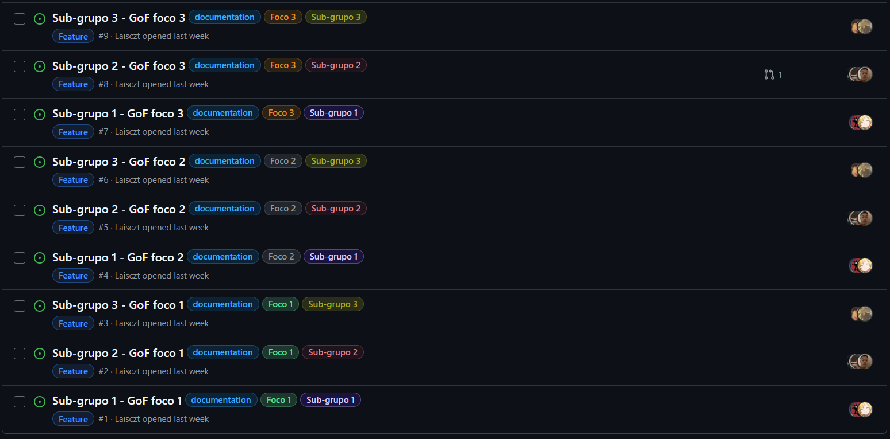

# 2.5. Iniciativas Extras (Modelagem)

## 1. Introdução
Este documento serve para apresentar as iniciativas extras realizadas pelo grupo 05 no escopo da entrega 02. Cada tópico corresponde a uma iniciativa extra e detalha a metodologia adotada em cada uma

## 2. Issues
Para garantir um acompanhamento eficiente do progresso do projeto e uma organização clara das tarefas, adotamos a prática de utilizar o [**GitHub Issues**](https://github.com/features/issues) como ferramenta central de gerenciamento de atividades e problemas. Todas as **issues** foram catalogadas no repositório do projeto, garantindo que cada uma delas tivesse um responsável designado para sua resolução.

A metodologia adotada consistiu em detalhar cada **issue** com informações objetivas sobre a tarefa ou problema a ser resolvido, atribuindo prazos e responsáveis para cada um dos itens. Isso incluiu tanto as atividades principais quanto as **relacionadas aos subgrupos**, como a criação e aprimoramento dos diagramas da modelagem estática, dinamica e organizacional. 

Cada subgrupo foi responsável por monitorar e atualizar as issues que envolviam suas respectivas tarefas, assim como linkar o commit ou pull request em que resolveu cada issue.

Essa abordagem permitiu uma gestão eficiente e transparente do progresso de cada atividade, assegurando que todas as tarefas fossem concluídas dentro dos prazos estabelecidos e com qualidade. Além disso, todas as issues foram devidamente comentadas e linkadas no **GitPages**, facilitando a comunicação e o acompanhamento por todos os membros do time.

Abaixo, na Imagem 1, é possível visualizar todas as issues como fechadas. Clicando [aqui](https://github.com/UnBArqDsw2025-1-Turma01/2025.1-T01-_G5_MundoMusical_Entrega_02/issues?q=is%3Aissue%20state%3Aclosed) você poderá visualizar todas as issues detalhadamente.

Figura 1 — Diagrama de Componentes

Autores: Arthur Heleno, Pedro Lucas Dourado, Laís Soares

## 3. Backlog no Trello
Para garantir o acompanhamento e a organização das tarefas ao longo do projeto, adotamos a ferramenta [Trello](https://trello.com/) para gerenciar o backlog do projeto. O Trello foi escolhido pela sua interface visual intuitiva e por permitir a gestão ágil das atividades de forma colaborativa.

A metodologia adotada consistiu em dividir o backlog em três categorias principais: Épicos, Funcionalidades e Histórias de Usuário. Cada categoria foi organizada em listas dentro do quadro do Trello, permitindo uma visualização clara do progresso das tarefas.

- Épicos: Representam grandes blocos de funcionalidades ou áreas do sistema que precisam ser implementadas. Estes épicos são desmembrados em tarefas menores para facilitar o gerenciamento.
- Funcionalidades: Cada funcionalidade é uma ação ou serviço que o sistema oferece, e foi descrita de forma a facilitar sua implementação. Essas funcionalidades foram agrupadas de acordo com os requisitos do sistema.
- Histórias de Usuário: Detalham as necessidades dos usuários e como essas funcionalidades devem ser atendidas pelo sistema, alinhando-se às expectativas dos stakeholders.

A utilização do [Trello](https://trello.com/) como ferramenta para gerenciar o backlog proporcionou uma organização clara, melhor comunicação entre os membros da equipe e visibilidade sobre o progresso incremental do backlog até a data de sua finalização.

Abaixo se encontra uma imagem do backlog dentro do site do trello e que você pode ver ele por completo clicando [aqui](https://trello.com/b/qaxQKzI8/backlog)

Figura 2 — Backlog Trello

Autores: Todos os membros do grupo

## 4. Atas de Reunião
Abaixo está listado todas as atas produzidas pelo grupo durante a entrega 02.

- [Ata 01 - 29/04/2025 ](Modelagem/Reunioes/ata01.md)
- [Ata 02 - 01/05/2025 ](Modelagem/Reunioes/ata02.md)
- [Ata 03 - 02/05/2025 ](Modelagem/Reunioes/ataClasses.md)
- [Ata 04 - 04/05/2025 ](Modelagem/Reunioes/ataEstados.md)
- [Ata 05 - 06/05/2025 ](Modelagem/Reunioes/ata_backlog1.md)
- [Ata 06 - 07/05/2025 ](Modelagem/Reunioes/ataPacotes.md)
- [Ata 07 - 08/05/2025 ](Modelagem/Reunioes/ataCaso_de_Uso.md)
- [Ata 08 - 08/05/2025 ](Modelagem/Reunioes/ata_backlog2.md)

## 5. Diagrama Entidade Relacionamento
Segundo Elmasri e Navathe, a modelagem conceitual é uma fase muito importante no projeto de uma aplicação de banco de dados bem-sucedida. Sob esse viés, o Diagrama Entidade-Relacionamento (DER) listado abaixo foi elaborado com o objetivo de representar de maneira visual as entidades do sistema e os relacionamentos entre elas. O modelo desenvolvido reflete as necessidades do sistema Mundo Musical, abordando as interações entre os usuários (alunos, professores e administradores) e os diversos componentes do sistema, como questões, turmas, conteúdos e avaliações. A partir deste diagrama, foi possível identificar as entidades centrais, seus atributos e como elas se inter-relacionam, o que facilita a compreensão da estrutura do banco de dados e o desenvolvimento das funcionalidades do sistema.

Para a confecção do diagrama, utilizamos a ferramenta BRModelo, que oferece um ambiente intuitivo para a criação e organização de diagramas de banco de dados. Essa ferramenta permitiu a modelagem clara e eficiente das entidades e seus relacionamentos, garantindo que o modelo fosse coeso e alinhado aos requisitos do sistema.

Além disso, como base teórica para a construção do DER, foi utilizado o livro "Sistemas de Banco de Dados" de Ramez Elmasri e Shamkant B. Navathe, que forneceu as diretrizes essenciais para a elaboração do diagrama, suas entidades e a definição dos relacionamentos.

### Versão final

Figura 3 — Versão final do DER

Autor: [Pedro Lucas Dourado](https://github.com/lucasdray)

### Versão inicial

Figura 4 — Versão inicial do DER

<iframe frameborder="0" style="width:100%;height:703px;" src="https://viewer.diagrams.net/?tags=%7B%7D&lightbox=1&highlight=0000ff&edit=_blank&layers=1&nav=1&title=Diagrama_ER.drawio&dark=auto#Uhttps%3A%2F%2Fdrive.google.com%2Fuc%3Fid%3D1HGd9T_CcQtLPse3Unj0OrHdCdQDpz_3f%26export%3Ddownload"></iframe>

Autor: [Amanda Abreu](https://github.com/Amandaaaaabreu)

### Referência Bibliográfica

> [1] ELMASRI, Ramez; NAVATHE, Shamkant B. Sistemas de banco de dados. Tradução: Daniel Vieira. Revisão técnica: Enzo Seraphim; Thatyana de Faria Piola Seraphim. 6. ed. São Paulo: Pearson Addison Wesley, 2011. Capítulo 7. Modelagem de dados usando o modelo Entidade-Relacionamento (ER), páginas 131 e 146.

## Histórico de Versão

| Versão | Data       | Data de Revisão | Descrição            | Autor(es)                                           | Revisor(es) | Detalhes da revisão |
| ------ | ---------- | --------------- | -------------------- | --------------------------------------------------- | ----------- | ------------------- |
| `1.0`  | 09/05/2025 |                 | Criação do documento | [Pedro Lucas Dourado](https://github.com/lucasdray) |         [Amanda](https://github.com/Amandaaaaabreu)    |        Realizando ajustes e correções finais na página de iniciativas extras. Conferindo links e imagens.             |
