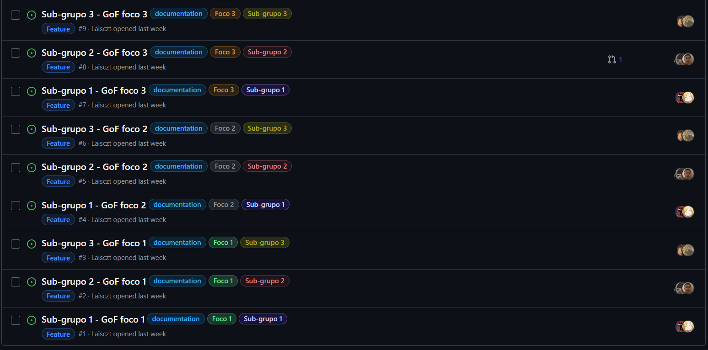
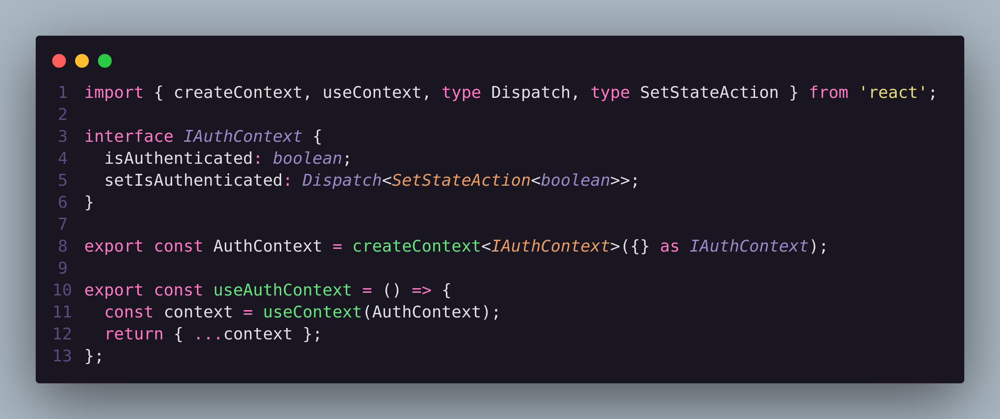
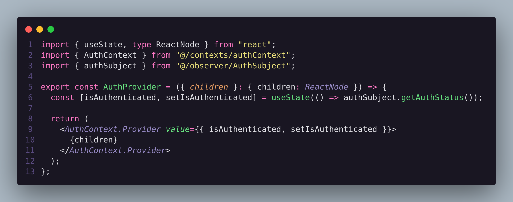
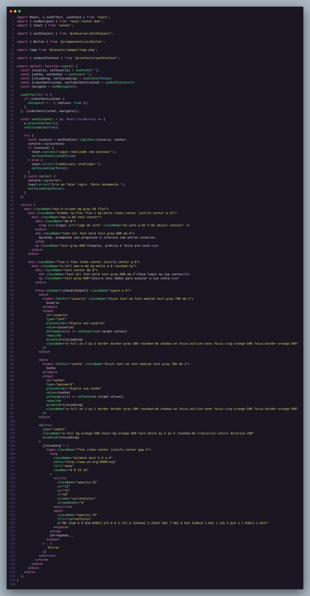
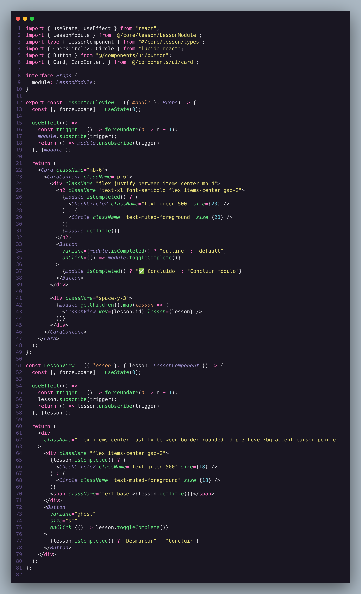

# 2.5. Iniciativas Extras (Modelagem)

## 1. Introdução
Este documento serve para apresentar as iniciativas extras realizadas pelo grupo 05 no escopo da entrega 02. Cada tópico corresponde a uma iniciativa extra e detalha a metodologia adotada em cada uma

## 2. Issues
Para garantir um acompanhamento eficiente do progresso do projeto e uma organização clara das tarefas, adotamos a prática de utilizar o [**GitHub Issues**](https://github.com/features/issues) como ferramenta central de gerenciamento de atividades e problemas. Todas as **issues** foram catalogadas no repositório do projeto, garantindo que cada uma delas tivesse um responsável designado para sua resolução.

A metodologia adotada consistiu em detalhar cada **issue** com informações objetivas sobre a tarefa ou problema a ser resolvido, atribuindo prazos e responsáveis para cada um dos itens. Isso incluiu tanto as atividades principais quanto as **relacionadas aos subgrupos**, em que cada subgrupo ficou responsável de realizar um GoF de cada tipo (Criacional, Estrutural e Comportamental). 

Cada subgrupo foi responsável por monitorar e atualizar as issues que envolviam suas respectivas tarefas, assim como linkar o commit ou pull request em que resolveu cada issue.

Essa abordagem permitiu uma gestão eficiente e transparente do progresso de cada atividade, assegurando que todas as tarefas fossem concluídas dentro dos prazos estabelecidos e com qualidade. Além disso, todas as issues foram devidamente comentadas e linkadas no **GitPages**, facilitando a comunicação e o acompanhamento por todos os membros do time.

Abaixo, na Imagem 1, é possível visualizar todas as issues como fechadas. Clicando [aqui](https://github.com/UnBArqDsw2025-1-Turma01/2025.1-T01-_G5_MundoMusical_Entrega_03/issues?q=is%3Aissue&page=1) você poderá visualizar todas as issues detalhadamente.

Figura 1 — Issues de cada Sub-Grupo

Autores: Laís Soares

## 3. Metodologia Adaptada

Para apoiar a criação dos padrões GoF, dividimos a equipe em três subgrupos especializados (criacional, estrutural e comportamental), realizamos reuniões semanais de alinhamento para inspecionar progresso e remover impedimentos, mantivemos relatórios diários via WhatsApp para comunicação rápida, adotamos refatoração contínua para preservar a qualidade do código, utilizamos um quadro Kanban adaptado para controlar tarefas e aplicamos um Design Sprint estendido em duas semanas para prototipar e validar ideias antes da implementação. Todas as etapas estão detalhadas no arquivo Metodologias Utilizadas no Projeto.

## 4. Atas de Reunião
Abaixo está listado todas as atas produzidas pelo grupo durante a entrega 02.

- [Ata 01 - 29/04/2025 ](PadroesDeProjeto/Reunioes/ata01.md)
- [Ata 02 - ata 01 do subgrupo 03 ](PadroesDeProjeto/Reunioes/ata_01_subgrupo03.md)

## 5. Context Api e Custom Hooks
A API de contexto é útil para passar dados pela árvore de componentes sem precisar passar adereços manualmente em todos os níveis, resolvendo o problema de "prop drilling (Passar parâmetros de componente pai para componente filho em muitos níveis)". Já os Custom Hooks são uma extensão poderosa do padrão Hooks, permitindo que você encapsule lógica reutilizável e gerenciamento de estado em funções.

Figura 2 - Definição da Api de Contexto e do Custom Hook de autenticação

Figura 3 - Definição do Provider do contexto e utilização dos states presentes no Custom Hook

## 6. Controlled Components
No React, os componentes controlados dependem do estado do React para controlar as entradas do formulário

Figura 4 - Componente de Login contendo controle dos valores dos inputs

## 7. Compound Components
Componentes compostos são um padrão flexível em que vários componentes trabalham juntos como uma única unidade, permitindo que os usuários personalizem como os componentes filhos são renderizados dentro de um componente pai.

Figura 5 - Composite de Lições que compoem o módulo de Lições

## 8. Referencias

> <a id="REF1" >1.</a> SERRANO, Milene. (2025). _1.4. Participações (Base)_. Disponível em: https://github.com/UnBArqDsw2025-1-Turma01/RepositorioTemplateEntrega3/blob/main/docs/PadroesDeProjeto/3.5.IniciativasExtras.md . Acesso em: 30 mai. 2025.
> <a id="REF2" >2.</a> React Design Patterns. Disponível em: https://www.uxpin.com/studio/blog/react-design-patterns/ . Acesso em: 02 jun. 2025.

## Histórico de Versão

| Versão | Data       | Data de Revisão | Descrição                                     | Autor(es)                                           | Revisor(es)                                 | Detalhes da revisão                                                                                |
| ------ | ---------- | --------------- | --------------------------------------------- | --------------------------------------------------- | ------------------------------------------- | -------------------------------------------------------------------------------------------------- |
| `1.0`  | 09/05/2025 |                 | Criação do documento                          | [Pedro Lucas Dourado](https://github.com/lucasdray) | [Amanda](https://github.com/Amandaaaaabreu) | Realizando ajustes e correções finais na página de iniciativas extras. Conferindo links e imagens. |
| `2.0`  | 01/06/2025 |                 | Estruturação para Entrega 03                  | [Pedro Lucas Dourado](https://github.com/lucasdray) |                                             |                                                                                                    |
| `2.1`  | 02/06/2025 |                 | Adição Referencia Correta e restante das Atas | [Pedro Lucas Dourado](https://github.com/lucasdray) |                                             |                                                                                                    |
| `2.2`  | 02/06/2025 |                 | Adição de mais iniciativas extras | [Lucas Caldas](https://github.com/lucascaldasb) |                                             |                                                                                                    |
