# Padrão de Projeto Observer

## 1. Introdução

O padrão Observer é um dos padrões comportamentais mais utilizados no desenvolvimento de software. Ele define uma dependência um-para-muitos entre objetos, de forma que quando um objeto muda seu estado, todos os seus dependentes são automaticamente notificados e atualizados. Essa abordagem facilita a comunicação entre componentes, promovendo baixo acoplamento e alta coesão no sistema.

## 2. O que é o Padrão Observer?

O padrão Observer permite que um objeto, chamado **Sujeito** (Subject), mantenha uma lista de dependentes chamados **Observadores** (Observers) e os notifique automaticamente sobre qualquer mudança de estado, geralmente chamando um método de atualização. 

De acordo com o site Refactoring Guru:

> "O padrão Observer define uma dependência um-para-muitos entre objetos de forma que quando um objeto muda de estado, todos os seus dependentes são notificados e atualizados automaticamente."  
> (Fonte: [Refactoring Guru - Observer](https://refactoring.guru/pt-br/design-patterns/observer))

Essa comunicação entre sujeito e observadores ocorre de forma transparente e desacoplada, permitindo que os observadores reajam às mudanças sem que o sujeito precise conhecer detalhes específicos deles.

## 3. Objetivo

- **Promover baixo acoplamento** entre o objeto que gera eventos e os objetos que respondem a esses eventos.
- **Permitir múltiplos observadores** para um único sujeito, possibilitando a propagação de atualizações para diversos componentes interessados.
- **Facilitar a manutenção e extensão** do sistema, uma vez que novos observadores podem ser adicionados sem modificar o sujeito.

## 4. Quando Usar

- Quando mudanças no estado de um objeto devem refletir em outros objetos automaticamente.
- Quando um objeto deve notificar outros objetos sem precisar saber quem são esses objetos ou como eles funcionam internamente.
- Para implementar sistemas baseados em eventos, como interfaces gráficas, sistemas distribuídos, ou mecanismos de assinatura e notificação.
- Quando se deseja promover uma arquitetura mais flexível e extensível, evitando acoplamento rígido entre componentes.

## 5. Estrutura do Padrão

- **Subject (Sujeito):** Mantém uma lista de observadores e fornece métodos para adicionar, remover e notificar observadores.
- **Observer (Observador):** Define uma interface para atualizar os objetos dependentes.
- **ConcreteSubject (Sujeito Concreto):** Implementa a interface do sujeito e armazena o estado de interesse para os observadores.
- **ConcreteObserver (Observador Concreto):** Implementa a interface de observador para reagir às mudanças no sujeito.

## 6. Vantagens

- **Desacoplamento:** O sujeito não precisa conhecer detalhes dos observadores, facilitando a manutenção e evolução do sistema.
- **Flexibilidade:** Possibilita que múltiplos observadores sejam adicionados ou removidos dinamicamente.
- **Reutilização:** Observadores podem ser reutilizados em diferentes contextos sem modificações no sujeito.

## 7. Desvantagens

- **Possível impacto na performance:** Muitas notificações podem gerar sobrecarga se a lista de observadores for muito grande.
- **Dificuldade no controle da ordem de notificações:** A ordem na qual os observadores são atualizados pode não ser garantida.
- **Gestão de memória:** Se não for bem gerenciado, pode haver vazamentos de memória devido a observadores que não são removidos corretamente.

## 8. Conclusão

O padrão Observer é fundamental para o desenvolvimento de sistemas reativos e orientados a eventos, permitindo que componentes permaneçam independentes e facilmente expansíveis. Sua aplicação adequada contribui para um código mais limpo, modular e aderente aos princípios de design orientado a objetos.

## 9. Implementações

### 9.1 Trocar Tema - Pedro Lucas Dourado

O código implementa o padrão Observer para gerenciar o tema da interface (claro/escuro) de forma reativa em uma aplicação React. A classe ThemeSubject mantém o estado atual do tema e uma lista de funções observadoras que são notificadas sempre que o tema muda. Os observadores podem se inscrever e cancelar a inscrição para receber essas notificações.

O hook useThemeObserver conecta componentes React ao ThemeSubject, atualizando o estado local do tema sempre que ocorre uma mudança. Isso garante que qualquer componente que use esse hook será re-renderizado automaticamente quando o tema for alternado. O componente ThemeSwitcher utiliza esse hook para exibir o tema atual e fornecer um botão que dispara a mudança de tema via ThemeSubject.

Dessa forma, a aplicação mantém um baixo acoplamento entre o estado global do tema e seus consumidores, promovendo uma arquitetura limpa e reativa, onde múltiplos componentes podem ser facilmente sincronizados com as mudanças do tema sem dependências diretas.

**Figura 01 - Theme Subject**

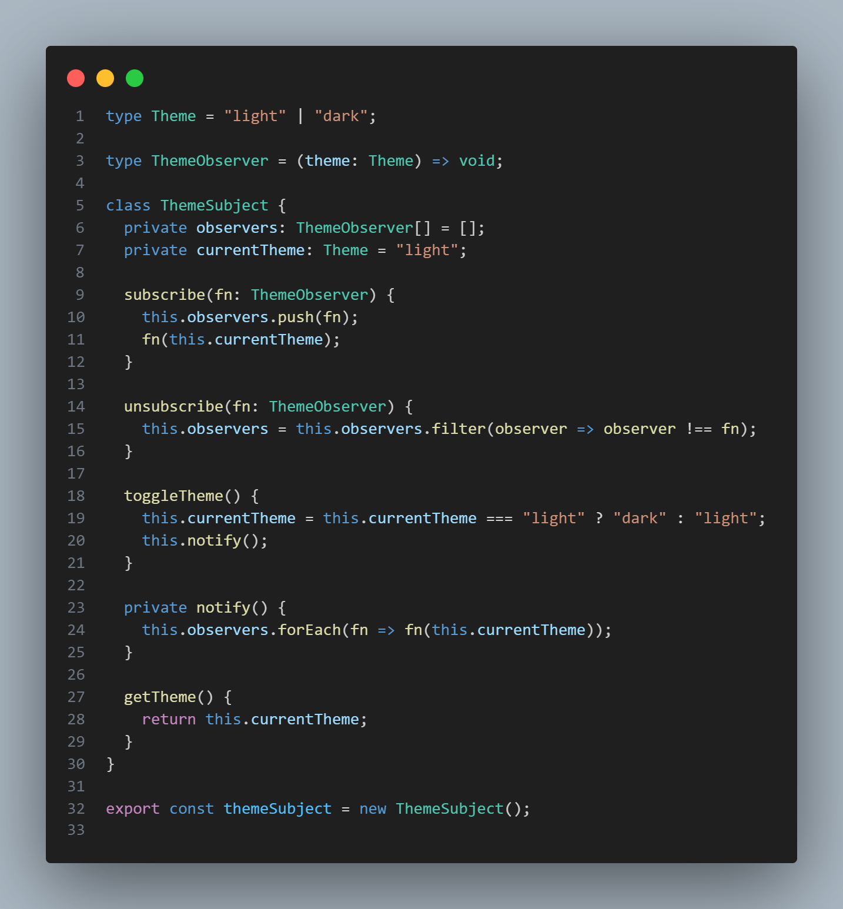

*Fonte: [Pedro Lucas Dourado](https://github.com/lucasdray)*

**Figura 02 - Theme Switcher**

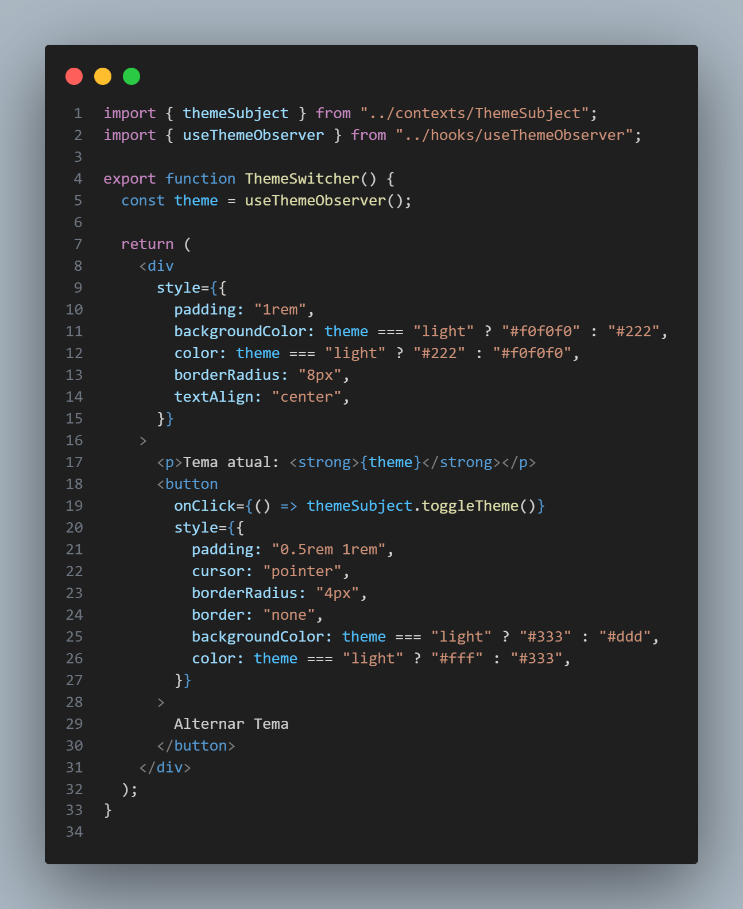

*Fonte: [Pedro Lucas Dourado](https://github.com/lucasdray)*

**Figura 03 - useThemeObserver**

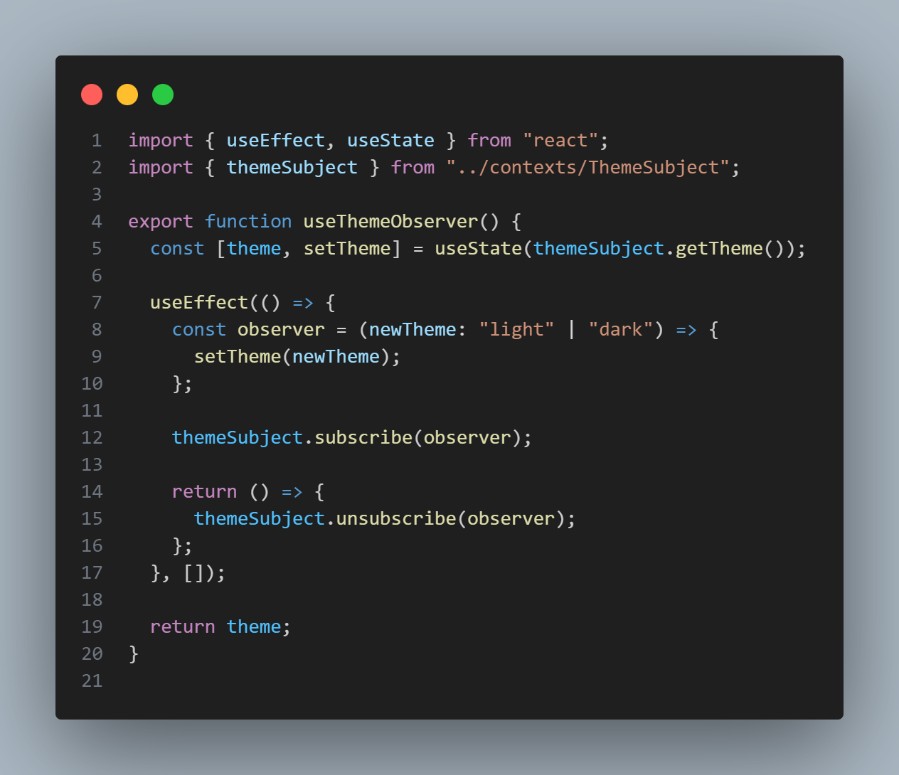

*Fonte: [Pedro Lucas Dourado](https://github.com/lucasdray)*

**Vídeo 01 - Resultado**
Abaixo pode-se assistir o vídeo mostrando o resultado, ou [clicando aqui](https://www.youtube.com/watch?v=RIz48hb8ViI)

<iframe width="560" height="315" src="https://www.youtube.com/embed/RIz48hb8ViI?si=AcSPhNviqrkk9G5n" title="YouTube video player" frameborder="0" allow="accelerometer; autoplay; clipboard-write; encrypted-media; gyroscope; picture-in-picture; web-share" referrerpolicy="strict-origin-when-cross-origin" allowfullscreen></iframe>

### 9.2 Notificação de Autenticação - Enrico Martins Mantoan Zoratto

Permite que componentes React (como Login e PrivateRoute) reajam dinamicamente a mudanças no estado de autenticação, mantendo um baixo acoplamento.

**Figura 04 - Estrutura do Observer**

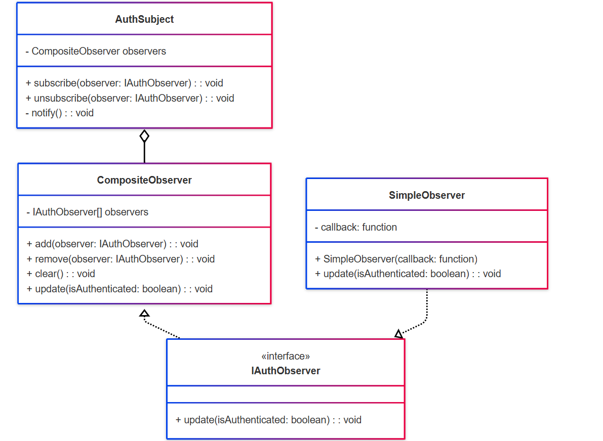

*Fonte: [Enrico Martins Mantoan Zoratto](https://github.com/sidts)*

**Figura 05 - Lógica de notificação do Observer**

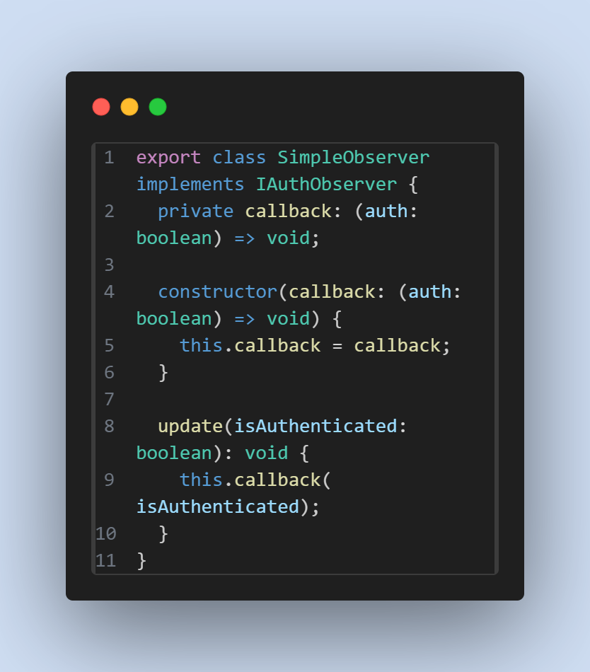

*Fonte: [Enrico Martins Mantoan Zoratto](https://github.com/sidts)*

**Figura 06 - Notificação da autenticação**

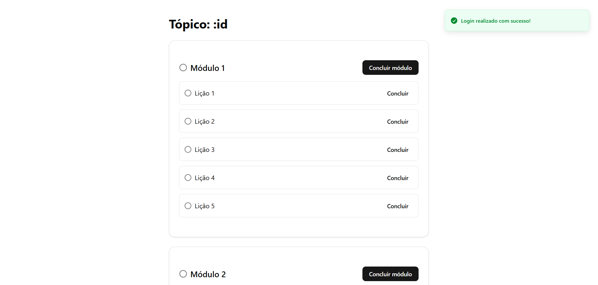

*Fonte: [Enrico Martins Mantoan Zoratto](https://github.com/sidts)*

### 9.3 Lições concluídas - Sebastián Héctor Zuzunaga Rosado

A funcionalidade de conclusão das lições no LessonBox foi implementada com base no padrão Observer, com o objetivo de desacoplar a lógica de atualização de progresso da interface de usuário. Nesse padrão, o LessonBox atua como o Subject (Sujeito), enquanto qualquer função ou componente que deseje reagir a mudanças (como a finalização de uma lição) atua como o Observer (Observador).

**Figura 01 - Subject**

*Fonte: [Sebastián Zuzunaga](https://github.com/sebazac332)*

**Figura 02 - Subject específico**

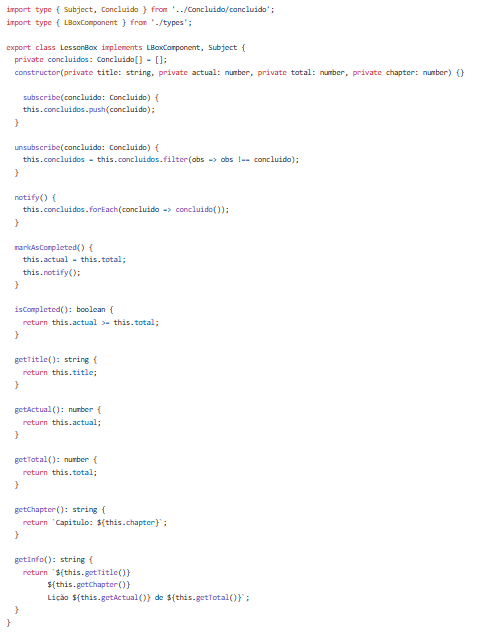

*Fonte: [Sebastián Zuzunaga](https://github.com/sebazac332)*

**Figura 03 - Observer**

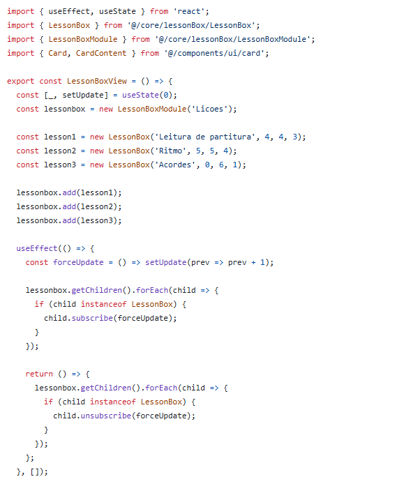

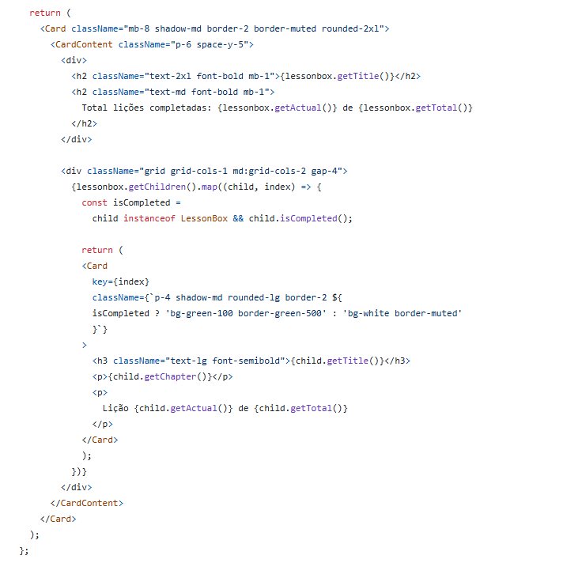

*Fonte: [Sebastián Zuzunaga](https://github.com/sebazac332)*

**Figura 04 - Resultado**

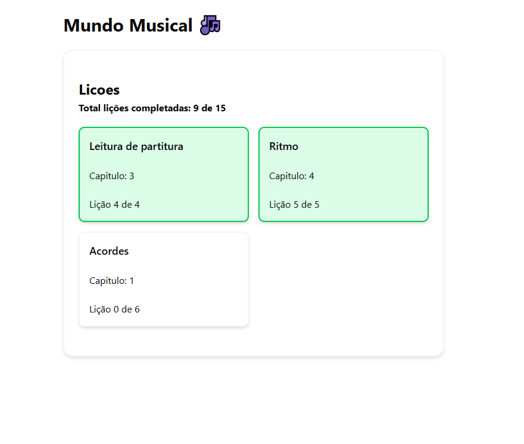

**Figura 05 - Estrutura do Observer**

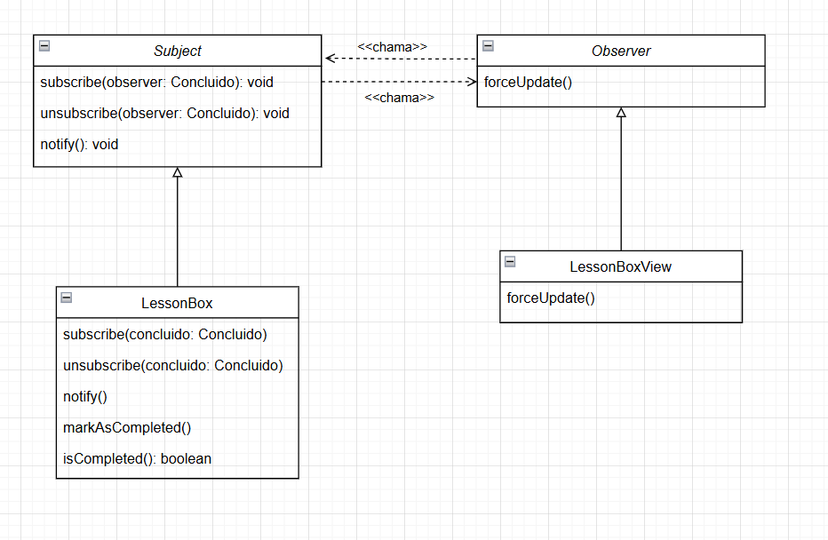

 

## 10. Referências Bibliográficas

- Gamma, E., Helm, R., Johnson, R., & Vlissides, J. (1995). *Design Patterns: Elements of Reusable Object-Oriented Software*. Addison-Wesley.
- Refactoring Guru. Observer Pattern. Disponível em: [https://refactoring.guru/pt-br/design-patterns/observer](https://refactoring.guru/pt-br/design-patterns/observer). Acesso em: 02/06/2025.
- SERRANO, M.. Material em Slides. Disponível em: https://aprender3.unb.br/pluginfile.php/3075187/mod_page/content/1/Arquitetura%20e%20Desenho%20de%20Software%20-%20Aula%20GoFs%20Estruturais%20-%20Profa.%20Milene.pdf Acesso em: 02 jun. 2025.
- SERRANO, M. Vídeo-Aula - DSW - GoFs - Comportamentais. Disponível em: https://unbbr-my.sharepoint.com/:v:/g/personal/mileneserrano_unb_br/Ed5jtliOrNVOlKoPe-6Llp0BNLgJ9Q6NHPIKnzmshzHmvA?e=517a4O. Acesso em: 02 jun. 2025.
---

## Histórico de Versão

| Versão | Data       | Data de Revisão | Descrição                                                                                | Autor(es)                                           | Revisor(es) | Detalhes da revisão |
| ------ | ---------- | --------------- | ---------------------------------------------------------------------------------------- | --------------------------------------------------- | ----------- | ------------------- |
| 1.0    | 02/06/2025 |                 | Criação e estruturação do documento, adição da implementação relacionada a troca de tema | [Pedro Lucas Dourado](https://github.com/lucasdray) |             |                     |

