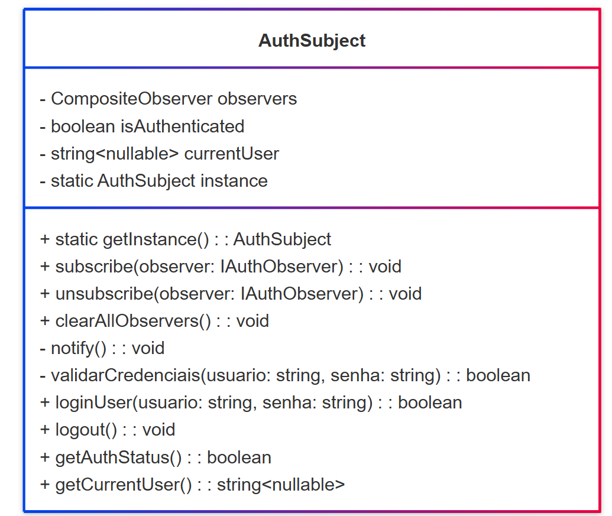
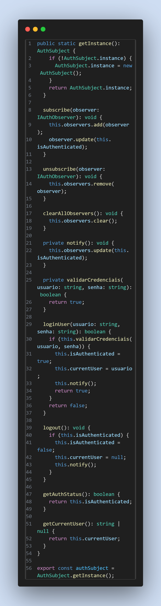

# Padrão de Projeto Singleton

## 1. Introdução

O padrão Singleton é um dos padrões de projeto criacionais apresentados pelo Gang of Four (GoF) no clássico livro *Design Patterns: Elements of Reusable Object-Oriented Software* (Gamma et al., 1995). Ele visa controlar a criação de instâncias de uma classe para garantir que apenas uma única instância exista durante toda a execução do sistema, fornecendo um ponto global de acesso a essa instância.

Este padrão é amplamente utilizado quando é necessário controlar recursos compartilhados, como conexões com banco de dados, gerenciadores de configuração, ou qualquer objeto cujo estado deve ser único e consistente ao longo do tempo.

## 2. O que é o Padrão Singleton?

O Singleton define uma classe que pode ter somente uma instância, e oferece um método estático para acessar essa instância. Ele encapsula o processo de criação do objeto e garante que a mesma instância seja usada por toda a aplicação.

Segundo a Profa. Milene Serrano (2025), os padrões GoF criacionais lidam com a complexidade da criação de objetos em sistemas orientados a objetos, e o Singleton é um desses padrões que “permite a criação de uma única instância de uma classe e fornece um modo de recuperá-la” (Serrano, *Arquitetura e Desenho de Software*, aula GoFs Criacionais).

Além disso, conforme explicado no site Refactoring Guru:

> "O padrão Singleton garante que uma classe tenha somente uma instância e fornece um ponto global de acesso a ela. Ele é útil quando exatamente um objeto é necessário para coordenar ações em todo o sistema."  
> [Refactoring Guru - Singleton](https://refactoring.guru/pt-br/design-patterns/singleton)

## 3. Objetivo

- Garantir que uma classe tenha somente uma instância durante a execução da aplicação.
- Fornecer um ponto global de acesso a essa instância única.
- Controlar o acesso à instância para evitar múltiplas criações desnecessárias.

## 4. Quando Usar

- Quando é necessário garantir que exista somente um objeto de uma classe (exemplo: gerenciador de conexão com banco de dados).
- Quando um ponto global de acesso à instância é desejado.
- Para evitar conflito de múltiplas instâncias que possam provocar inconsistências no estado do sistema.
- Em cenários onde a criação e o gerenciamento de instâncias precisa ser centralizado e controlado.

## 5. Estrutura do Padrão

O padrão Singleton envolve os seguintes participantes principais:

- **Singleton**: a classe que mantém a única instância e fornece o método para acessá-la. Geralmente, o construtor é privado para impedir criação externa.
- **Instância única**: uma variável estática privada que armazena a instância única da classe.
- **Método de acesso**: método público e estático que retorna a instância única, criando-a se ainda não existir.

## 6. Vantagens

- **Controle total da instância:** evita criação de múltiplos objetos desnecessários.
- **Ponto global de acesso:** facilita o acesso à instância por qualquer parte do sistema.
- **Redução de uso de recursos:** evita desperdício de memória e processamento com múltiplas instâncias.
- **Implementação simples:** o padrão é direto e fácil de implementar.

## 7. Desvantagens

- **Dificuldade para testes unitários:** a presença de uma instância global pode dificultar a criação de testes isolados.
- **Risco de acoplamento excessivo:** ao acessar diretamente a instância global, as classes podem ficar fortemente acopladas.
- **Problemas em ambientes multithread:** se não implementado com cuidado, pode causar condições de corrida na criação da instância.
- **Violação do princípio de responsabilidade única:** a classe Singleton assume tanto a lógica de negócio quanto a responsabilidade da gestão da instância.

## 8. Conclusão

O padrão Singleton é uma solução consolidada para controlar a criação única de instâncias em sistemas orientados a objetos, garantindo um ponto global de acesso a objetos únicos. Sua simplicidade e utilidade o tornam bastante comum em projetos de software, especialmente para gerenciar recursos compartilhados. Contudo, deve ser aplicado com cautela, considerando impactos no design, testabilidade e concorrência.

## 9. Implementações

### 9.1 Audio Manager - Pedro Lucas Dourado
O AudioManager é uma classe que gerencia a reprodução de áudio no sistema garantindo que exista apenas uma única instância durante toda a execução da aplicação, seguindo o padrão Singleton. Isso evita múltiplas instâncias conflitantes e centraliza o controle do áudio.

A classe permite carregar um arquivo de áudio a partir de uma URL, gerenciando eventos para garantir que o áudio esteja completamente carregado antes de ser reproduzido. Ela oferece métodos para reproduzir, pausar, parar e ajustar o volume do áudio, além de verificar se o áudio está atualmente em reprodução.

Ao utilizar o Singleton, o AudioManager assegura que todas as chamadas para manipulação do áudio operem sobre a mesma instância, evitando comportamentos inesperados causados por instâncias múltiplas e facilitando o gerenciamento global do áudio na aplicação.

**Figura 01 - Audio Manager**

*Fonte: [Pedro Lucas Dourado](https://github.com/lucasdray)*

**Figura 02 - Resultado**

### 9.1 Controle Global de Autenticação - Enrico Martins Mantoan Zoratto

Garante que apenas uma instância do AuthSubject exista na aplicação, centralizando o estado de autenticação e evitando inconsistências.

**Figura 03 - Estrutura do Singleton**

*Fonte: [Enrico Martins Mantoan Zoratto](https://github.com/sidts)*

**Figura 04 - Controle de autenticação do Singleton**

*Fonte: [Enrico Martins Mantoan Zoratto](https://github.com/sidts)*

## 10. Referências Bibliográficas

- Gamma, E., Helm, R., Johnson, R., & Vlissides, J. (1995). *Design Patterns: Elements of Reusable Object-Oriented Software*. Addison-Wesley.
- Serrano, M. (2025). *Arquitetura e Desenho de Software - Aula GoFs Criacionais*. Universidade de Brasília - UnB.
- Refactoring Guru. Singleton Design Pattern. Disponível em: [https://refactoring.guru/pt-br/design-patterns/singleton](https://refactoring.guru/pt-br/design-patterns/singleton). Acesso em 02/06/2025.

## Histórico de Versão

| Versão | Data       | Data de Revisão | Descrição                                                                                 | Autor(es)                                           | Revisor(es) | Detalhes da revisão |
| ------ | ---------- | --------------- | ----------------------------------------------------------------------------------------- | --------------------------------------------------- | ----------- | ------------------- |
| 1.0    | 02/06/2025 |                 | Criação e estruturação do documento, adição da implementação relacionada ao audio manager | [Pedro Lucas Dourado](https://github.com/lucasdray) |             |                     |

