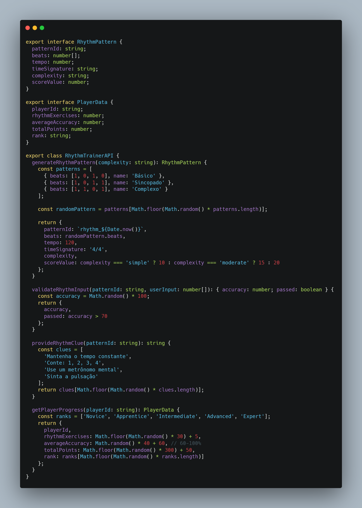
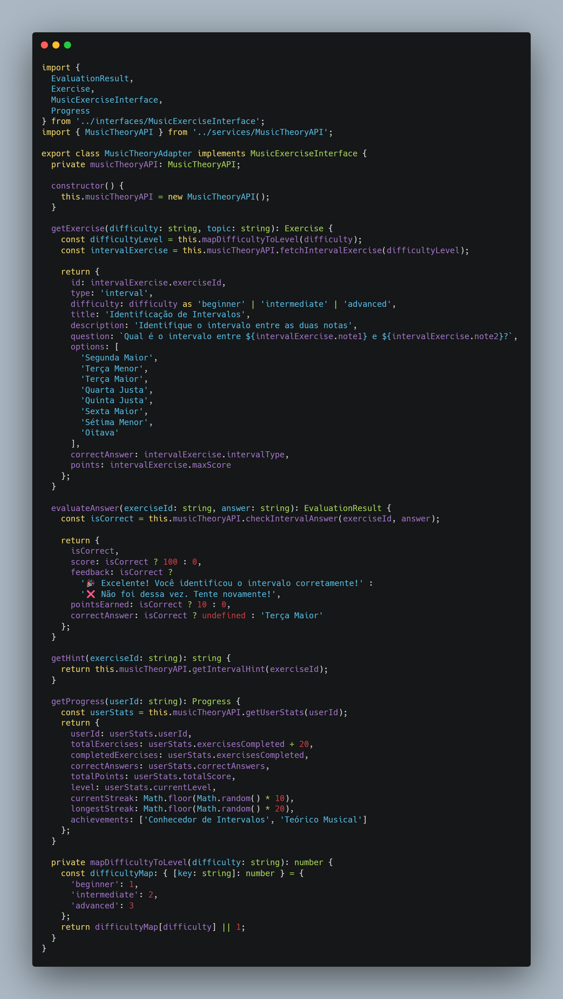
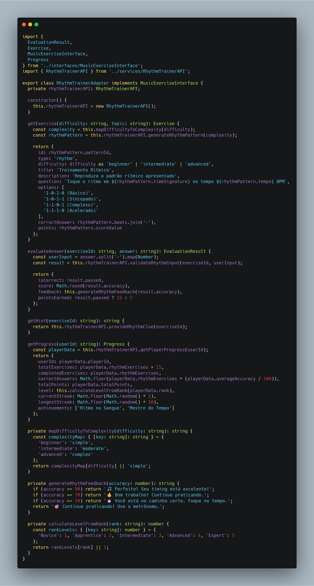
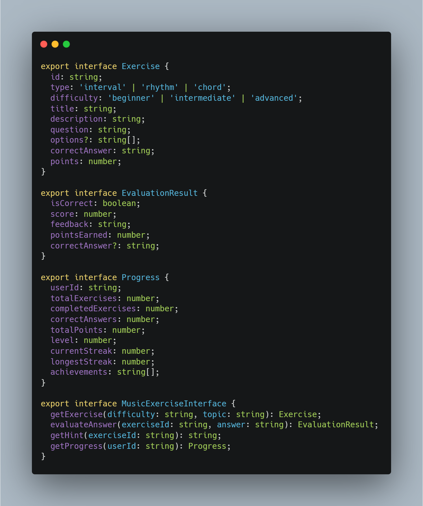
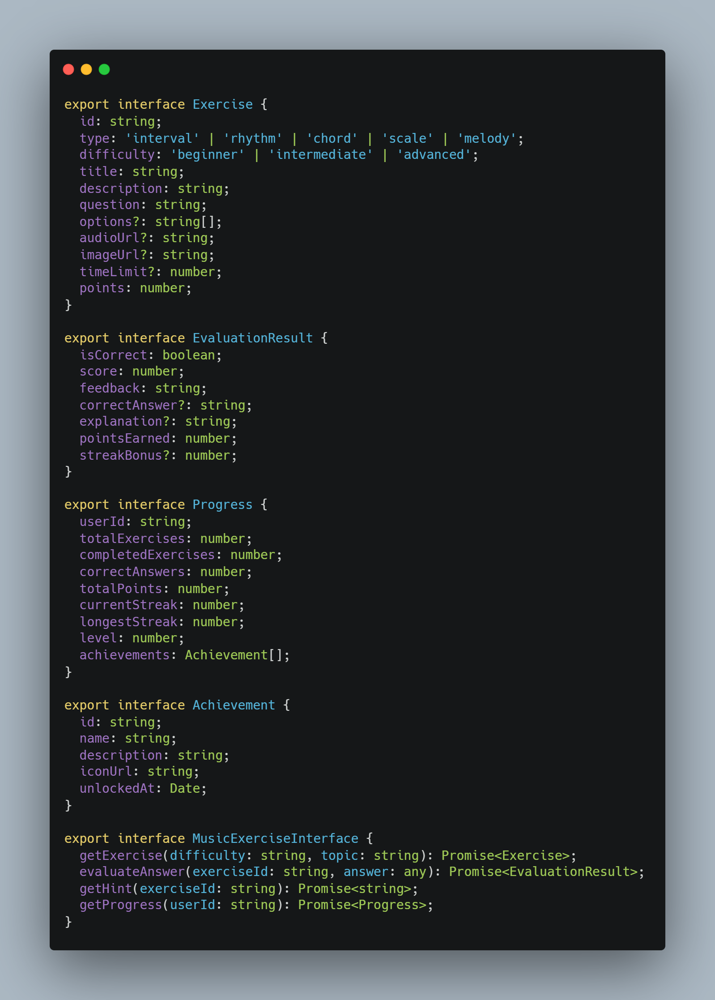
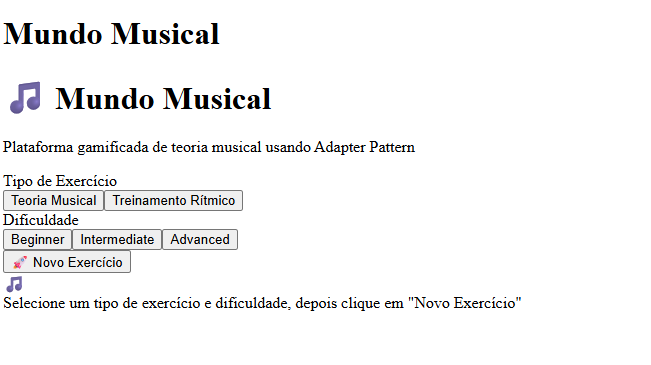

# Adapter

## Introdução

O padrão estrutural **Adapter** permite que objetos com interfaces incompatíveis trabalhem juntos. Ele atua como um wrapper que converte a interface de uma classe em outra interface esperada pelos clientes, permitindo que classes que não poderiam trabalhar juntas devido a interfaces incompatíveis possam colaborar.

### Objetivo

Permitir que um objeto seja substituído por outro que, apesar de realizar a mesma tarefa, possui uma interface diferente, facilitando a integração entre sistemas ou componentes com interfaces distintas.

---

## Metodologia

### Processo de Trabalho

A implementação do padrão Adapter seguiu as seguintes etapas:

1. **Identificação do Problema**: No projeto Mundo Musical, havia a necessidade de integrar diferentes sistemas de exercícios musicais (teoria e ritmo), cada um com sua própria interface, em uma plataforma única e coesa.
2. **Análise das Interfaces**: Foram mapeadas as interfaces dos sistemas de teoria musical e de treinamento rítmico, identificando suas incompatibilidades.
3. **Modelagem UML**: Criação do diagrama de classes para representar a estrutura do Adapter.
4. **Implementação**: Desenvolvimento dos adapters para unificar o acesso aos diferentes sistemas.
5. **Testes**: Validação da funcionalidade integrada na plataforma.

### Ferramentas Utilizadas

- **Linguagem de Programação**: TypeScript (React)
- **IDE**: VSCode
- **Ferramentas de Modelagem**: Lucidchart para diagramas UML
- **Controle de Versão**: Git/GitHub

### Justificativa

O padrão Adapter foi empregado para permitir a integração de diferentes módulos de exercícios musicais sem a necessidade de modificar o código legado de cada sistema. Esta escolha permite:

- Integração sem modificar código existente
- Reutilização de componentes legados
- Manutenção da compatibilidade
- Facilitar futuras extensões

---
## Implementação

### Interfaces Originais

**Insira prints dos arquivos de interface originais, por exemplo:**

- `MusicTheoryAPI.ts`
- `RhythmTrainerAPI.ts`

Exemplo de como inserir:

```markdown
#### Interface original de teoria musical


#### Interface original de treinamento rítmico


```

---

### Adapter

**Insira prints dos adapters implementados:**

- `MusicTheoryAdapter.ts`
- `RhythmTrainerAdapter.ts`

Exemplo:

```markdown
#### Adapter para teoria musical



#### Adapter para treinamento rítmico


```

---

### Interface Unificada

**Insira print da interface unificada que o Adapter expõe para o sistema:**

- `MusicExerciseInterface.ts`

```markdown
#### Interface unificada


```

---

### Uso do Adapter no Sistema

**Insira print do trecho de código onde o Adapter é utilizado no componente principal:**

- `MundoMusicalLearningSystem.ts`
- `MundoMusicalComponent.tsx` (trecho onde instancia e usa o adapter)

```markdown
#### Uso do Adapter no sistema



```

---

## Resultado Visual

**Insira print da tela do sistema funcionando, mostrando a integração dos exercícios via Adapter:**

```markdown
#### Tela da plataforma Mundo Musical


```

---

## Conclusão

O padrão Adapter permitiu a integração eficiente de diferentes sistemas de exercícios musicais na plataforma Mundo Musical, promovendo reutilização de código, manutenção facilitada e possibilidade de expansão futura para novos tipos de exercícios.
