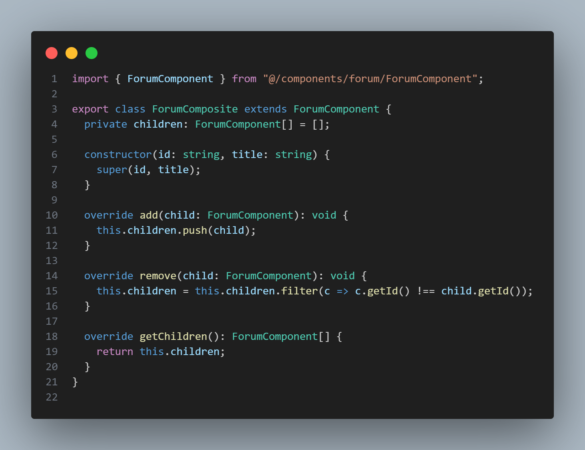

# Padrão de Projeto Composite

## 1. Introdução

O padrão Composite é um dos padrões de projeto estruturais descritos pelo Gang of Four (GoF), que tem como objetivo principal tratar objetos individuais e composições de objetos de maneira uniforme. Esse padrão facilita o desenvolvimento de estruturas hierárquicas do tipo "parte-todo" (whole-part), onde tanto objetos simples (folhas) quanto composições (nós internos) são tratados de forma homogênea.

## 2. O que é o Padrão Composite?

O Composite permite agrupar objetos que fazem parte de uma relação parte-todo, possibilitando que os clientes manipulem objetos individuais e composições da mesma forma, sem distinção.

Conforme apresentado por Gamma et al. (1995) e sintetizado na aula da Profa. Milene Serrano:

> "Agrupar objetos que fazem parte de uma relação parte-todo de forma a tratá-los sem distinção."  
> (Fonte: Arquitetura e Desenho de Software - Aula GoFs Estruturais - Profa. Milene Serrano)

Isso promove flexibilidade na estruturação do software, simplificando a manipulação de árvores ou estruturas hierárquicas complexas.

## 3. Objetivo

- Representar hierarquias do tipo parte-todo (whole-part) de forma transparente;
- Permitir que clientes manipulem objetos simples e compostos de maneira uniforme;
- Reduzir o acoplamento entre objetos e facilitar a manutenção do código.

## 4. Quando Usar

- Quando é necessário representar objetos hierárquicos em estruturas em árvore;
- Quando clientes precisam tratar objetos individuais e composições uniformemente;
- Quando é desejável simplificar o código que manipula estruturas complexas, evitando condicional para distinguir folhas e composições.

## 5. Estrutura do Padrão

- **Component**: Interface comum para objetos simples e compostos, declarando operações que podem ser feitas tanto nas folhas quanto nos nós compostos.
- **Leaf (Folha)**: Representa os objetos simples que não possuem filhos.
- **Composite**: Representa objetos que possuem filhos, podendo armazenar e gerenciar componentes filhos, implementando as operações definidas na interface Component.

## 6. Vantagens

- Facilita o tratamento uniforme de objetos simples e compostos;
- Simplifica o código do cliente, pois ele não precisa distinguir entre folhas e compostos;
- Permite construir estruturas complexas de forma recursiva e flexível.

## 7. Desvantagens

- Pode dificultar a restrição de tipos de componentes filhos, pois a interface comum torna menos explícita essa diferenciação;
- Pode aumentar a complexidade do sistema devido à generalização da interface;
- A implementação pode envolver a criação de muitos objetos, impactando a performance.

## 8. Conclusão

O padrão Composite é uma solução poderosa para representar hierarquias parte-todo, possibilitando que estruturas complexas sejam manipuladas de forma transparente e uniforme. Ao promover baixo acoplamento e flexibilidade, é amplamente utilizado em sistemas que precisam representar árvores ou gráficos hierárquicos, como sistemas de arquivos, interfaces gráficas e cenários de roteamento.

## 9. Implementações

As implementações do padrão Composite baseiam-se em uma interface comum para componentes e classes que representam folhas e composições. A estrutura permite que métodos sejam chamados uniformemente, facilitando o uso recursivo em estruturas hierárquicas.

### 9.1 Comentários no Fórum - Pedro Lucas Dourado

A funcionalidade de componentes do fórum tem como objetivo estruturar a apresentação e o gerenciamento dos elementos da interface, permitindo a organização hierárquica dos tópicos e comentários dentro do sistema. Essa arquitetura segue o padrão Composite para facilitar o tratamento uniforme de componentes simples (como comentários individuais) e compostos (como tópicos com várias respostas), garantindo flexibilidade e escalabilidade na implementação do fórum.

A seguir, são apresentadas as imagens que ilustram a estrutura dos componentes envolvidos, evidenciando a organização modular do sistema.

**Figura 01 - Forum Component**

*Fonte: [Pedro Lucas Dourado](https://github.com/lucasdray)*

**Figura 02 - Forum Composite**

*Fonte: [Pedro Lucas Dourado](https://github.com/lucasdray)*

**Figura 03 - Forum Leaf**

*Fonte: [Pedro Lucas Dourado](https://github.com/lucasdray)*

**Figura 04 - Resultado**

### 9.2 Lista de lições - Sebastián Héctor Zuzunaga Rosado

A funcionalidade dos componentes da listagem de lições permitem representar estruturas hierárquicas de lições como se fossem objetos únicos. Cada LessonBox representa uma lição individual com informações como título, capítulo, progresso atual e total de atividades. Já o LessonBoxModule atua como um contêiner composto, capaz de agrupar diversas lições (LessonBox) e calcular o progresso total de forma agregada.

A seguir, são apresentadas as imagens que ilustram a estrutura dos componentes envolvidos, evidenciando a organização modular do sistema.

**Figura 01 - Lista de lições Component**

*Fonte: [Sebastián Zuzunaga](https://github.com/sebazac332)*

**Figura 02 - Lista de lições Composite**

*Fonte: [Sebastián Zuzunaga](https://github.com/sebazac332)*

**Figura 03 - Lista de lições Leaf**

*Fonte: [Sebastián Zuzunaga](https://github.com/sebazac332)*

**Figura 04 - Resultado**

*Fonte: [Sebastián Zuzunaga](https://github.com/sebazac332)*

## 10. Referências Bibliográficas

- Gamma, Erich; Helm, Richard; Johnson, Ralph; Vlissides, John. *Design Patterns: Elements of Reusable Object-Oriented Software*. Addison-Wesley, 1995.
- Serrano, Milene. *Arquitetura e Desenho de Software - Aula GoFs Estruturais*. Universidade de Brasília, 2025. Disponível em: arquivo PDF fornecido pelo usuário.
- Refactoring Guru. *Composite Design Pattern*. Disponível em: [https://refactoring.guru/design-patterns/composite](https://refactoring.guru/design-patterns/composite)

---

## Histórico de Versão

| Versão | Data       | Data de Revisão | Descrição                                                                                      | Autor(es)                                           | Revisor(es) | Detalhes da revisão |
| ------ | ---------- | --------------- | ---------------------------------------------------------------------------------------------- | --------------------------------------------------- | ----------- | ------------------- |
| 1.0    | 02/06/2025 |                 | Criação e estruturação do documento, adição da implementação relacionada as mensagens do forum | [Pedro Lucas Dourado](https://github.com/lucasdray) |             |                     |

